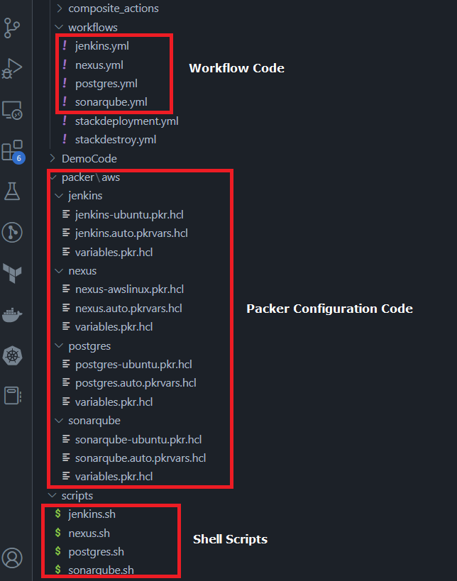
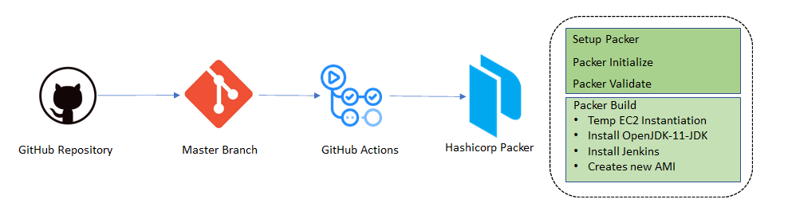
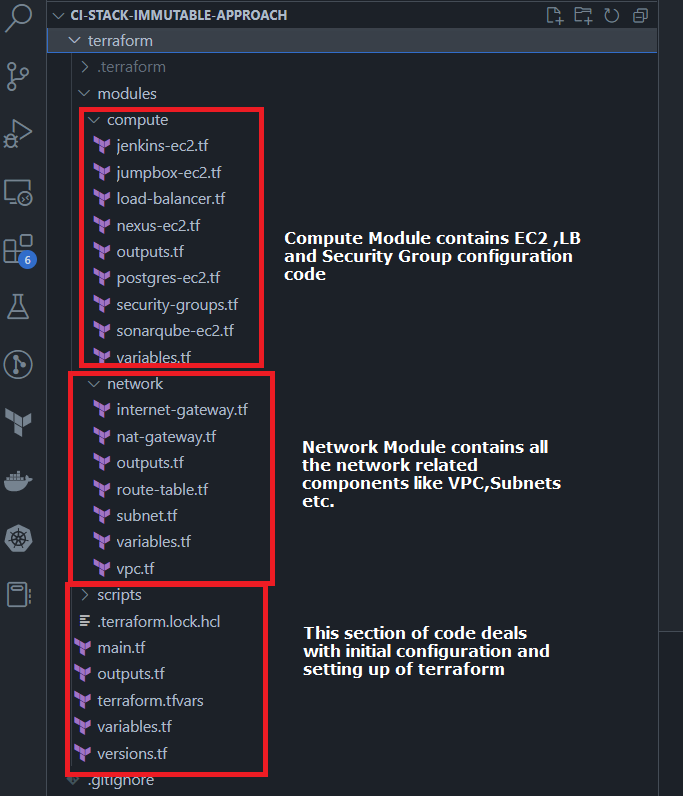
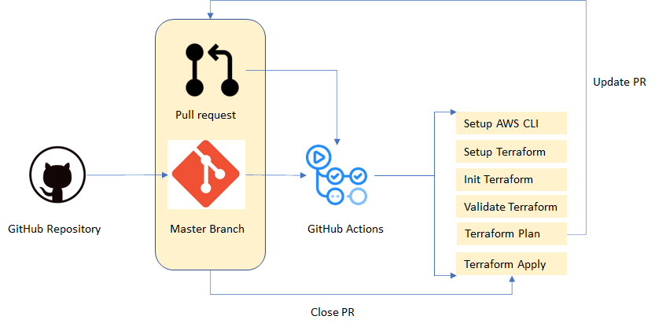
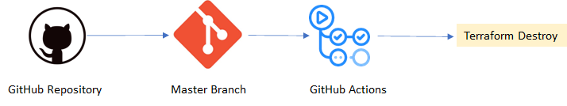

# CI/CD Infrastructure deployment using Terraform, GitHub Actions with custom machine images by Packer

In this repository, I discuss about CI/CD, it’s benefits along with Immutable infrastructure and it’s advantages. Then I set up **four GitHub Actions workflows** for creating machine images using **Packer**. After that, I deploy a multi-tier network using **Terraform** configurations and utilize custom machine images to **deploy CI/CD infrastructure**. Infrastructure deployment was carried out by GitHub actions workflows. Finally, I clean up and remove the deployment using destroy workflow.

## CI/CD and it's benefits

Continuous Integration (CI) and Continuous Deployment (CD) are practices used in software development to streamline the process of building, testing, and deploying software changes.

Continuous Integration is the practice of frequently integrating code changes into a shared repository, where automated build and testing tools are used to verify the correctness of the changes. By doing so, it allows for the early detection of integration issues and conflicts, which ultimately leads to less time spent on fixing bugs and more time spent on developing new features.

Continuous Deployment is the practice of automatically deploying code changes to production once they have passed through the testing stage. This means that as soon as a new code change is pushed to the shared repository, it goes through automated testing and if the tests pass, it is automatically deployed to production.

The benefits of CI/CD includes faster feedback loop, more reliable and consistent deployments, and improved collaboration, ultimately leading to faster time-to-market and competitive advantage.

## Immutable infrastructure and advantages

Immutable infrastructure is an approach to managing IT infrastructure where infrastructure components such as virtual machines, containers, and network configurations are treated as immutable, meaning that they are never modified once deployed. Instead, new instances are created and deployed to replace the existing instances whenever there is a change or an update.

Immutable infrastructure makes easier to maintain a consistent and predictable environment. It is more secure because any changes made to the system will not be persistent. Any malicious activity can be detected and remediated by simply replacing the affected instances.Moreover, it leads to faster and more reliable deployment. Morst importantly, it is highly scalable as new instances can be easily created and deployed to handle increasing workloads. This enables organizations to adapt to changes quickly and easily in demand.

Overall, immutable infrastructure provides a more reliable, secure, and scalable approach to managing IT infrastructure. It allows organizations to focus on building and deploying new applications and services, rather than maintaining and troubleshooting existing infrastructure.

## Why Use Packer

Packer is a tool for creating machine images (e.g., Amazon Machine Images - AMIs for AWS) in an automated and repeatable manner. In this specific context, Packer is being used to create a custom AMI for Jenkins. Here's why Packer is beneficial:

- **Immutable Infrastructure:** Packer helps create immutable infrastructure by generating machine images that contain the exact configuration and software you need. This ensures consistency and repeatability in your deployments.

- **Speed:** Packer can build images in parallel, which can be much faster than setting up a new instance from scratch and configuring it manually every time you need Jenkins.

- **Version Control:** Just like your application code, Packer configurations are version-controlled, making it easier to track changes and collaborate with a team.

- **Automation:** Packer enables you to automate the creation of machine images, reducing manual intervention and potential human errors.

## CI/CD Immutable infrastructure with custom machine images

We are going to deploy CI/CD infrastructure within a multi-tier network. CI/CD infrastructure consists of **1 Jenkins build server**, **1 Nexus Repository manager server**, and **1 SonarQube server** along with sonarqube’s persistent layer as a **PostgreSQL server**.

We will deploy a VPC with four different Subnets. Two subnets will be public and two will be private. We will deploy **5 EC2 machines**, 4 in private subnets and 1 in the public subnet. One EC2 instance for Jenkin, Nexus, SonarQube, and PostgreSQL servers, and 1 EC2 will be the bastion host/Jump box machine, which deployed in a public subnet. NAT Gateway is deployed in public subnet and it’s routes were registered in the routing table to give incoming traffic to EC2 deployed in private subnets.

All these EC2 machines were deployed by using custom machine AMIs created with immutable infra-deployment workflows in GitHub Actions. After the successful deployment of the infrastructure stack, we can access Jenkins, Nexus, and SonarQube user interface using load balancer DNS URL with the desired port combination.

## Machine Image Creation using Packer and GitHub Actions

Creating machine images using Packer and GitHub Actions is a powerful way to automate the process of building and deploying infrastructure in the cloud. Here are the basic steps to get started:

1. Install Packer: Packer is a tool for creating machine images that can be used on various cloud providers. Install it on our local machine or in the GitHub Actions runner.

2. Create a Packer template: This is an HCL file that defines the image we want to create. It can include information about the base image, any software to be installed, and any configuration that needs to be done.

3. Store the Packer template in your repository: Commit the Packer template to your GitHub repository so that it can be used by GitHub Actions.

4. Create a GitHub Actions workflow: This is a YAML file that defines the steps to be taken when the workflow is triggered. In this case, we will define the steps to build the machine image using Packer and upload it to your cloud provider.

5. Set up environment variables: Store any sensitive information such as cloud provider credentials or API keys as GitHub secrets or in your repository's environment variables.

6. Trigger the GitHub Actions workflow: When we are ready to create the machine image, trigger the GitHub Actions workflow. The workflow will use the Packer template to build the machine image and upload it to your cloud provider.

7. Verify the machine image: After the workflow completes, verify that the machine image was created successfully and that it is working as expected.

8. Use the machine image: Use the machine image to deploy infrastructure in the cloud, such as virtual machines, containers, or serverless functions.

Using Packer and GitHub Actions together can save time and improve consistency in the process of creating machine images. It also enables collaboration with other developers and makes it easier to version control and audit changes to the machine image.

## Code Structure of Machine Image Creation Workflows

The above figure shows files for GitHub Actions (Workflow Code), immutable configuration code (Packer Configuration Code), and Linux shell scripts (Shell Scripts) for building the configuration inside an immutable infrastructure.

### Jenkins Workflow

The above figure shows the GitHub Actions workflow, which builds Jenkins machine image. Installation of OpenJDK-11-JDK and Jenkins are the main highlights of building the machine image.

To build a Jenkins machine image, GitHub workflow runs github/jenkins.yaml, and files in /packer/aws/jenkins along with scripts/jenkins.sh. Similarly, We implement separate GitHub Actions workflow for other servers, e.g. nexux, postgres, sonarqube, as well.

## Infrastructure deployment using Terraform and GitHub Actions

Terraform is an open-source infrastructure as code (IAC) tool that allows us to automate the deployment of infrastructure resources across multiple cloud platforms, including AWS, Azure, and Google Cloud. GitHub Actions, on the other hand, is a powerful automation tool that enables you to automate various tasks, including infrastructure deployment.

Combining Terraform and GitHub Actions, you can create a powerful deployment pipeline that automates the deployment of infrastructure resources to your cloud platform. 

### Code Structure of Infrastructure Deployment Workflow

The above figure shows files for building the configuration to deploy CI/CD infrastructure using Terraform code. This code uses the machine image created by the machine image creation workflow.

### Plan and Execute Workflow

With a pull request to terraform codebase, infrastructure deployment workflow gets triggered and we can see the terraform plan in the pull request, once we close the pull request and merge the code, terraform apply action gets triggered. Around 37 resources should be created.

## Clean-Up Workflow

The above figure shows the GitHub Actions workflow which deletes the deployed infrastructure.